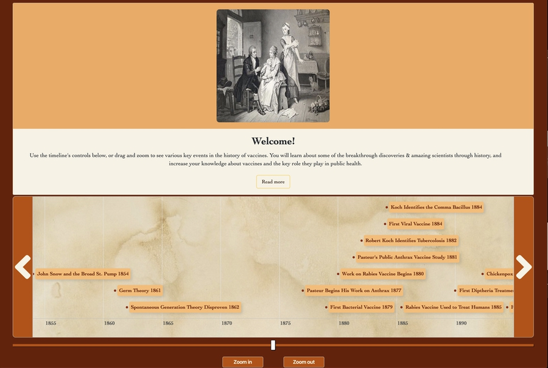

# Vaccination, Visually
 ## History of vaccination displayed as a timeline

 # 

 **[See the live demo here](https://ronanmc99.github.io/VaccinationVisually/)**
 
 # Introduction
 This project is an educational single-page website for those interested in the history of vaccination.  I was inspired by the award-winning website [historyofvaccines.org](http://www.historyofvaccines.org), provided by The College of Physicians of Philadelphia.  I was impressed by the way this tool represents the known history of events related to vaccination in visual form. 

My aim was to provide an interactive timeline similar to the above.  This allows the user to see the key events in the history of vaccines, learn about some of the discoveries & people involved, and in doing so, increase their knowledge and understanding of how vaccines work and the role they play in public health.

## Project requirements

1. Users are able to interact with the site so they may learn about historical events related to the subject of vaccination.

2. The site owner advances their own goals by providing this functionality by being a regular user themselves, and by collaborating with others.

### Use Cases
As a student of Biomedical Science, I have recently become very interested in vaccination and recognise that a resource like this can be very useful to other students, parents of young children and educators in this field.

#### Use cases include:
* Students who are learning about the history of vaccination and want to increase their knowledge around the subject.
* Students who are preparing to write a research paper and want both an overview of the history and additional information about key events.
* Teachers or lecturers who are teaching students about vaccination and the key events that occurred during its history.
* Parents who are interested in vaccination as it relates to their children and want to understand the subject more deeply.

## UX
* The user experience is about communicating information about the history of vaccination in a clear and simple way so that it can be a useful educational resource.

* The experience should make it very easy for me to interact with the data - for example, scrolling through the timeline, clicking on an item to learn more about it, or to see it's references.  

* I want to be able to interact with the site with minimal prompting, however, if I require instruction on how to interact with the site, it should be obvious how to do so.

* As a user, I am seeking information and want to be able to find that information quickly, clearly and intuitively, so that the site becomes an effective learning or reference resource.

* As a user, I want to be able to see historical events on a timeline to that I can see the various scientific advances across the years, and get a feel for how quickly or slowly these advances happened, and where they key moments in history occurred.

* By clicking on an event, I want to be able to get additional information about that event.  An example would be a hover-over item or tooltip containing text, images or a link.  This would allow the timeline to act as a hub, or a starting point for research or discussion.

* A scroll feature on the timeline will allow the user to see the specific date range they are interested in.  This also makes the information contained within more readable, as otherwise it could become crowded.

* Timeline date indicators should therefore be clearly visible.

* Site navigation will be minimal, serving to provide additional information about the main timeline content - for example data sources and references.  This provides a cleaner interface which is easily readable on an overhead projector during a presentation or when making notes.

* I want to be able to view the timeline on a variety of devices, whether mobile, tablet or desktop.

* I want to see visual images incorporated within the timeline as this can help with understanding the event, provide talking points for discussion or to aid in recall, if this were used in a research situation

## Design
Using these requirements, a wireframe was created in Balsamiq mockups 3, then a colour scheme was chosen before creating a prototype in Sketch.  

Due to the nature of this application, it is best viewed on desktop, and so the design is desktop-first.  There are however additional rules for mobile displays to make it useable on any platform.

* [View the wireframe here.](https://drive.google.com/open?id=1PtDDZF3UihQ7iBGl2shMcdwPPNM8xy65)
* [View the colour palette here.](https://drive.google.com/open?id=1Z92Ij7JmWBHzj4OH9vzUsAubB9de6C2L)

## Installation
The site is a simple, one page web application and may be installed on a stand alone server or forked and re-developed for your own purposes.

### To install:
* Copy the repo to your local server
* Page home is index.html
* Ensure path structure is preserved or update paths accordinglly

### Main Technologies:
### Required: HTML, CSS, JavaScript
### Libraries:

[Vis.js - this provides an interactive chart for visualising data on a timeline.](https://visjs.github.io/)

[Moment.js - Parse, validate, manipulate, and display dates and times in JavaScript](https://momentjs.com/)

[Handlebars.js - HTML templating for timeline items](https://handlebarsjs.com/)

Data are stored in an array with options configured in the vis-timeline script.js file.  This solution can be expanded if necssary to accomodate more item data while preserving performance. The timeline will accept a data set (allowing 2 way binding), which can hold and manipulate data and listen for changes in the data. The DataSet is key/value based, and can be manipulated using add, update, remove and clear methods. [See this link for more information](https://almende.github.io/vis/docs/data/dataset.html)

### Google Forms Integration
The application includes a submission form so that users may collaborate by suggesting events to add to the timeline.  This is an active form which has been integrated with the site's contact form.  Thanks to DeveloperDrive for instructions on this.  If you are installing this application yourself, [please see these instructions here.](https://www.developerdrive.com/add-google-forms-static-site/)

## Deployment
To deploy this application, I first created a repo and folder structure then and published to github using git init:
### Directory structure
/index.html
    |--assets
        |--css
        |--images
        |--js
        |--moment
        |--template
        |--vis

### Git 
I used git commands (push / pull / checkout/ branch / merge etc.) from within the terminal in VS Code, as well as commenting.  The Git desktop application for Mac OS was used to access & manage branches and merges, as it provides a simplified workflow.

### Github Pages
The application has been published with Github pages directly from the repo settings, and the [live demo can be found here.](https://ronanmc99.github.io/VaccinationVisually/)

## Testing
This site has been tested and verifed on:
* Chrome 80
* Safari 13
* Firefox 74

A test plan was created to verify all functionality.  [This plan can be found here.](https://docs.google.com/spreadsheets/d/1BCZdp2I7cS0wGBGs0mh_fjt1qq66xnk2h1by3AxcMfU/edit?usp=sharing)

## Future Improvements
* Additional timeline item content, each with a reference / citation and suitably formatted image
* Option to filter item content using Vis.js data manipulation methods
* Move items object to external file and optimise for performance
* Custom thank you page

## Contribution
**This project is licensed under the terms of the MIT license.**

### Code Contribution
Thanks for taking the time to contribute!

I would like to develop this project in the future to make it more useful for students and teachers.  If you would like to make a code contribution, a user-experience contribution, or suggest new timeline items, [please contact me using this form...](https://docs.google.com/forms/d/e/1FAIpQLSdwW_cqZAElyPt2Ip-ExrKovTIJxUO-vNA_D8ZFpS17u3GRLA/viewform?usp=pp_url&entry.819054409=Enter+your+name&entry.1952725725=Your+best+email&entry.1799255694=What+will+your+title+be?+(120+chars+max)&entry.7694047=Please+enter+your+description+which+should+be+1-3+paragraphs+and+less+than+250+words.++Include+verifiable+references+(required)+and+a+link+to+a+suitable+image+(optional))

### Issues
If you find an issue, please help by sending any information with may be helpful to understand the problem.

For example:
How to reproduce the issue, step-by-step.
The expected behavior (or what is wrong).
Screenshots.
The application version.
The operating system.

## Guides / Resources
Visjs Timeline 
* [Vis - Documentation for Timeline can be found here](https://visjs.github.io/vis-timeline/docs/timeline/)
* [Vis - Examples for Timeline can be found here](https://visjs.github.io/vis-timeline/examples/timeline/)
* [Handlebars HTML template documenation can be found here](http://handlebarsjs.com/guide/#what-is-handlebars)

## References and Credits
Thank you to the below resources and credits

### Scientific References:
https://www.ncbi.nlm.nih.gov/pmc/articles/PMC4659912/
https://www.ncbi.nlm.nih.gov/pmc/articles/PMC3407399/
https://www.jenner.ac.uk/about/edward-jenner
https://www.immunology.org/john-snows-pump-1854
https://courses.lumenlearning.com/microbiology/chapter/spontaneous-generation/
https://www.sciencehistory.org/historical-profile/louis-pasteur
https://www.vbivaccines.com/wire/louis-pasteur-attenuated-vaccine/
https://www.sciencehistory.org/historical-profile/louis-pasteur
https://www.ncbi.nlm.nih.gov/pmc/articles/PMC4659912/
https://www.sciencedirect.com/science/article/pii/S1198743X14608557
https://www.the-scientist.com/foundations/the-rabies-vaccine-backstory-33441?archived_content=9BmGYHLCH6vLGNdd9YzYFAqV8S3Xw3L5
https://jnnp.bmj.com/content/71/1/62
https://www.historyofvaccines.org/content/chickenpox-relationship-between-chickenpox-and-shingles-suggested
https://orangebeanindiana.com/2019/02/28/muncie-smallpox/
https://www.sciencehistory.org/historical-profile/louis-pasteur

### Content
Content was researched by myself using references and public data provided by:
https://www.ncbi.nlm.nih.gov/pmc/articles/PMC4659912/#B26
https://www.immunize.org/timeline/
https://www.ncbi.nlm.nih.gov/
https://www.chop.edu/centers-programs/vaccine-education-center/vaccine-history/developments-by-year
https://www.historyofvaccines.org

### Code Help
Big thank you to those developers out there who freely provide their time to help others!
* https://github.com/almende/vis
* https://codepen.io/jean2607
* https://css-tricks.com/
